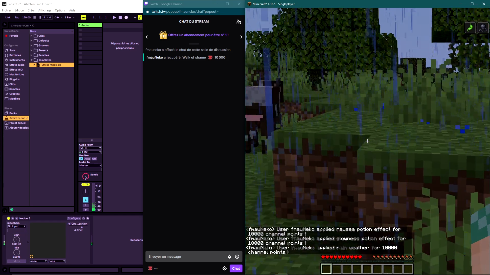

# Project Story

## Inspiration

We all have heard at least one streamer saying that channel points were useless until the bets came...
But we have already seen streamers who have great integration with some connected lights or customs scenes that change in OBS and that showed us that bets are not the only way to create interaction between viewers and the streamer using channel points.

Imagine you are a viewer and you could have a direct impact on the way the streamer is playing a game or the song he is composing for example if he/she is a musician.
Wouldn't that be great? Well, that's why we built Awesome Channel Points Manager!

We wanted to increase interaction between the streamer and his community by allowing viewers to interact directly with games like Minecraft
or by sending MIDI signals to trigger effects or play sounds of music software tools like Ableton Live.

## What it does

Awesome Channel Points Manager is a tool allowing to configure and control rewards of your channel, and to trigger effects when a reward is redeemed thanks to integrations with games or other programs you have on your computer!

### Connect with your Twitch account

The first thing you need to do is to sign in and to authorize Awesome Channel Points Manager to access your twitch account.

### Create custom rewards

The application retrieves custom rewards from your twitch channel and allows to configure them, enable and disable them, or also disable all of them if needed.

Then you can configure new rewards, define their cost and other options.
You can define groups to have presets and enable or disable rewards at ease.

We monitor the channel activity to enable/disable custom rewards based on the game filter you used. You can add multiple games filter to a custom rewards or none.

Awesome Channel Points Manager integrates a plugin system. In this first release we created 2 plugins:

- the first one allowing to connect to Minecraft thanks to our Minecraft Forge plugin allowing the viewers to give potions effect to the streamer (regeneration, poison, ...) or change the weather in the game.
- and the second one allowing to send MIDI signals that can be understood by many different music software tools like Ableton Live.

For the demo we created a Custom Rewards "Walk of shame" that applies "Nausea", "Slowness" and set the weather to Raining in Minecraft. But it also change the broadcaster voice pitch through MIDI signals.

## How we built it

We built an electron application that embeds a Node.js server and a React front-end.

The server is used to communicate with the Twitch API and the different APIs used by the plugins.
We handle rewards redemptions with the PubSub API.

The server can also send MIDI signals.

## Challenges we ran into

- Work together remotely and organize team work
- Technical challenges
  - How to interact with Twitch API
  - Writing a Minecraft plugin
  - How to integrate our application with music software tools like Ableton Live

## Accomplishments that we're proud of

- We managed to build a multi-platform application compatible with Linux, MacOS and Windows.
- Creation of a Minecraft plugin for the project.
- We had a lot of fun testing our plugins
  - by applying sound effects on our voice: changing pitch, reverb, exorcist voice, ...
  - by applying tons of effects to the player in Minecraft
- Technical solution for the demo has a dark theme!

## What we learned

- How to reverse engineer minecraft plugins to create our own.
- Interact with the Twitch Channel API
  - Auth Flows
  - Pub/Sub API
  - Custom Rewards API

## What's next for Awesome Channel Points Manager

We already know some streamers that could be interested in using such an application to manage and configure effects triggered by the redemption of custom rewards they define. So we will share our app with them and get their feedback!
We will also for sure use this application for our own streams and we already did.

And, if people like it, why not continue the development and make it become a real product, with more plugins and integrations with games and other tools!!
